# CIFAR-10-dataset-Classification using Keras
## Dataset
The CIFAR-10 and CIFAR-100 are labeled subsets of the 80 million tiny images dataset. They were collected by Alex Krizhevsky, Vinod Nair, and Geoffrey Hinton. 
But for this project we will be using the cifar-10 dataset only.

The CIFAR-10 dataset consists of 60000 32x32 colour images in 10 classes, with 6000 images per class. There are 50000 training images and 10000 test images.
The dataset is divided into five training batches and one test batch, each with 10000 images. The test batch contains exactly 1000 randomly-selected images from each class. The training batches contain the remaining images in random order, but some training batches may contain more images from one class than another. Between them, the training batches contain exactly 5000 images from each class.

Here are the classes in the dataset, as well as 10 random images from each:
<table>
    <tbody><tr>
        <td class="cifar-class-name">airplane</td>
        <td></td>
        <td></td>
        <td></td>
        <td></td>
        <td></td>
        <td></td>
        <td></td>
        <td></td>
        <td></td>
        <td></td>
    </tr>
    <tr>
        <td class="cifar-class-name">automobile</td>
        <td></td>
        <td></td>
        <td></td>
        <td></td>
        <td></td>
        <td>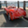</td>
        <td></td>
        <td></td>
        <td></td>
        <td></td>
    </tr>
    <tr>
        <td class="cifar-class-name">bird</td>
        <td></td>
        <td></td>
        <td>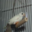</td>
        <td>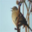</td>
        <td>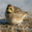</td>
        <td></td>
        <td></td>
        <td>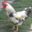</td>
        <td></td>
        <td></td>
    </tr>
    <tr>
        <td class="cifar-class-name">cat</td>
        <td></td>
        <td>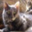</td>
        <td>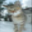</td>
        <td></td>
        <td></td>
        <td></td>
        <td></td>
        <td></td>
        <td></td>
        <td></td>
    </tr>
    <tr>
        <td class="cifar-class-name">deer</td>
        <td></td>
        <td></td>
        <td></td>
        <td></td>
        <td></td>
        <td></td>
        <td></td>
        <td></td>
        <td></td>
        <td>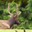</td>
    </tr>
    <tr>
        <td class="cifar-class-name">dog</td>
        <td></td>
        <td></td>
        <td></td>
        <td></td>
        <td></td>
        <td></td>
        <td></td>
        <td></td>
        <td></td>
        <td></td>
    </tr>
    <tr>
        <td class="cifar-class-name">frog</td>
        <td></td>
        <td>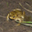</td>
        <td></td>
        <td></td>
        <td></td>
        <td></td>
        <td>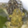</td>
        <td></td>
        <td></td>
        <td></td>
    </tr>
    <tr>
        <td class="cifar-class-name">horse</td>
        <td>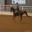</td>
        <td></td>
        <td>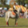</td>
        <td></td>
        <td></td>
        <td></td>
        <td></td>
        <td></td>
        <td></td>
        <td>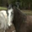</td>
    </tr>
    <tr>
        <td class="cifar-class-name">ship</td>
        <td></td>
        <td></td>
        <td></td>
        <td></td>
        <td></td>
        <td></td>
        <td></td>
        <td></td>
        <td></td>
        <td></td>
    </tr>
    <tr>
        <td class="cifar-class-name">truck</td>
        <td></td>
        <td></td>
        <td></td>
        <td></td>
        <td></td>
        <td></td>
        <td>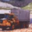</td>
        <td></td>
        <td></td>
        <td></td>
    </tr>
</tbody></table>

The classes are completely mutually exclusive. There is no overlap between automobiles and trucks. "Automobile" includes sedans, SUVs, things of that sort. "Truck" includes only big trucks. Neither includes pickup trucks.

## Model Architecture

1. Convolution with 64 filters of size of (3x3) 
   Droput layer 
   Batch Normalization layer
   
2. Convolution with 128 filters of size of (3x3) 
   Droput layer 
   Batch Normalization layer
   
3. Convolution with 256 filters of size of (3x3) 
   Droput layer 
   Batch Normalization layer
   
3. Convolution with 512 filters of size of (3x3) 
   Droput layer 
   Batch Normalization layer

4. Flatten layer 
   Dropout layer 

5. Dense layer with 128 neurons 
   Dropout layer 
   Batch Normalization layer

6. Dense layer with 256 neurons 
   Dropout layer 
   Batch Normalization layer

7. Dense layer with 512 neurons 
   Dropout layer 
   Batch Normalization layer

8. Dense layer with 1024 neurons 
   Dropout layer 
   Batch Normalization layer
   
9. Dense layer with 10 neurons (final layer with softmax activation) 

## Implementation accuracy
Train accuracy: 83.69% 
Test accuracy: 83.7% 

We can see that accuracy is not very high. It should be in the range of 95% to 100%. This happened because the model was trained for only 20 epochs. With a bit of tweaking of models layers, number of neurons in the dense layers, dropouts etc and training the model for 100 epochs will result in very high accuracy. But that takes up a lot of resources and time, hence I haven't implemented it for now. You can try it and do tell me what accuracies you get.

## The following additional plots and charts were made to understand the model beter.
<b>Loss vs Epochs</b>

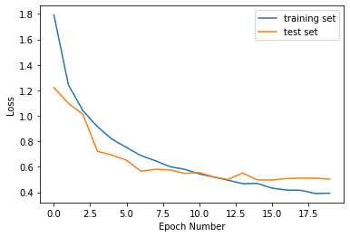

<b>Accuracy vs Epochs</b>

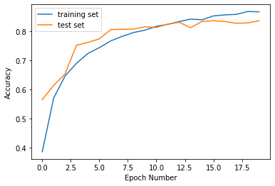

<b>Confusion Matrix</b> -- "Truth" stands for the actual value of the classification type whereas "predicted" stands for the predicted classification by the model. 

Here we can see how the confusion matrix  does not have all the elements on the diagonals. This is because of accuracy of 83.7%. As accuracy becomes higher, the diagonal matrix become full whereas rest of the matrix spaces tend to lower numbers. You can go through my <a href="https://github.com/Siddharth-ct/MNIST-dataset-classification-with-TensorFlow">MNIST dataset classification </a> repository to see better confusion matrix results.

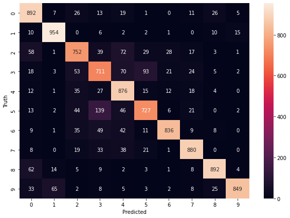

<b>Note:</b> Go through the Python Notebook. Each step has been explained briefly.

