# CIFAR-10-dataset-Classification using Keras
## Dataset
The CIFAR-10 and CIFAR-100 are labeled subsets of the 80 million tiny images dataset. They were collected by Alex Krizhevsky, Vinod Nair, and Geoffrey Hinton. 
But for this project we will be using the cifar-10 dataset only.

The CIFAR-10 dataset consists of 60000 32x32 colour images in 10 classes, with 6000 images per class. There are 50000 training images and 10000 test images.
The dataset is divided into five training batches and one test batch, each with 10000 images. The test batch contains exactly 1000 randomly-selected images from each class. The training batches contain the remaining images in random order, but some training batches may contain more images from one class than another. Between them, the training batches contain exactly 5000 images from each class.

Here are the classes in the dataset, as well as 10 random images from each:
<table>
    <tbody><tr>
        <td class="cifar-class-name">airplane</td>
        <td></td>
        <td></td>
        <td></td>
        <td></td>
        <td></td>
        <td>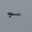</td>
        <td></td>
        <td></td>
        <td></td>
        <td></td>
    </tr>
    <tr>
        <td class="cifar-class-name">automobile</td>
        <td></td>
        <td>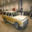</td>
        <td></td>
        <td></td>
        <td></td>
        <td></td>
        <td></td>
        <td></td>
        <td>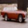</td>
        <td></td>
    </tr>
    <tr>
        <td class="cifar-class-name">bird</td>
        <td></td>
        <td>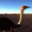</td>
        <td></td>
        <td></td>
        <td></td>
        <td></td>
        <td></td>
        <td></td>
        <td></td>
        <td></td>
    </tr>
    <tr>
        <td class="cifar-class-name">cat</td>
        <td></td>
        <td></td>
        <td></td>
        <td>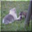</td>
        <td>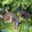</td>
        <td></td>
        <td></td>
        <td></td>
        <td></td>
        <td></td>
    </tr>
    <tr>
        <td class="cifar-class-name">deer</td>
        <td>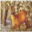</td>
        <td></td>
        <td></td>
        <td>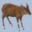</td>
        <td></td>
        <td></td>
        <td></td>
        <td>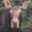</td>
        <td></td>
        <td></td>
    </tr>
    <tr>
        <td class="cifar-class-name">dog</td>
        <td>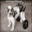</td>
        <td></td>
        <td></td>
        <td></td>
        <td></td>
        <td></td>
        <td></td>
        <td></td>
        <td></td>
        <td></td>
    </tr>
    <tr>
        <td class="cifar-class-name">frog</td>
        <td></td>
        <td></td>
        <td></td>
        <td>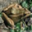</td>
        <td></td>
        <td></td>
        <td></td>
        <td></td>
        <td>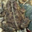</td>
        <td></td>
    </tr>
    <tr>
        <td class="cifar-class-name">horse</td>
        <td></td>
        <td></td>
        <td></td>
        <td></td>
        <td></td>
        <td></td>
        <td>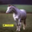</td>
        <td>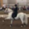</td>
        <td></td>
        <td></td>
    </tr>
    <tr>
        <td class="cifar-class-name">ship</td>
        <td></td>
        <td></td>
        <td></td>
        <td></td>
        <td></td>
        <td></td>
        <td></td>
        <td></td>
        <td></td>
        <td></td>
    </tr>
    <tr>
        <td class="cifar-class-name">truck</td>
        <td></td>
        <td></td>
        <td></td>
        <td></td>
        <td></td>
        <td>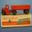</td>
        <td></td>
        <td>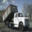</td>
        <td>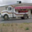</td>
        <td></td>
    </tr>
</tbody></table>

The classes are completely mutually exclusive. There is no overlap between automobiles and trucks. "Automobile" includes sedans, SUVs, things of that sort. "Truck" includes only big trucks. Neither includes pickup trucks.

## Image classification using Convolutional Neural Network (CNN) model on CIFAR-10 dataset
The model consists of 4 convolutional layers. Each of these convolutional layers are followed by a MaxPooling layer, a Droput layer and Batch normalization. The output of the earlier layers if flattened followed by 3 dense layers which have their own dropout and Batch normalization layers. The final layer consists of a dense layer with 10 neurons and soft-max activation to give the final ouput (prediction).

## Implementation accuracy
Train accuracy: % 
Test accuracy: % 

## The following additional plots and charts were made to understand the model beter.
Loss vs Epochs

Accuracy vs Epochs

Confusion Matrix -- "Truth" stands for the actual value of the classification type whereas "predicted" stands for the predicted classification by the model

Note: Go through the Python Notebook. Each step has been explained briefly.

